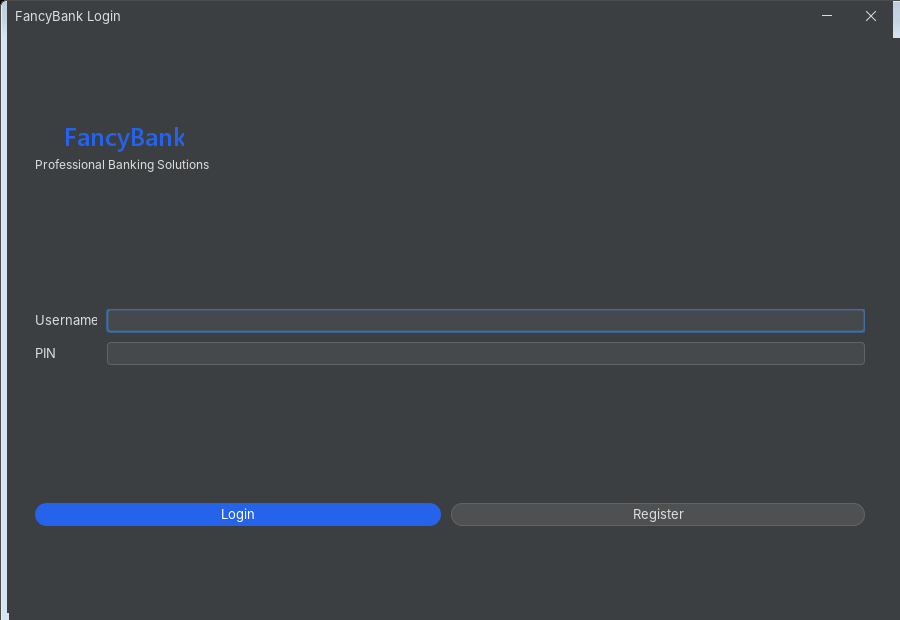
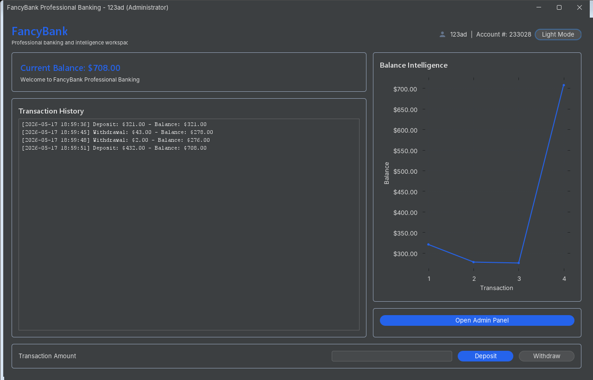
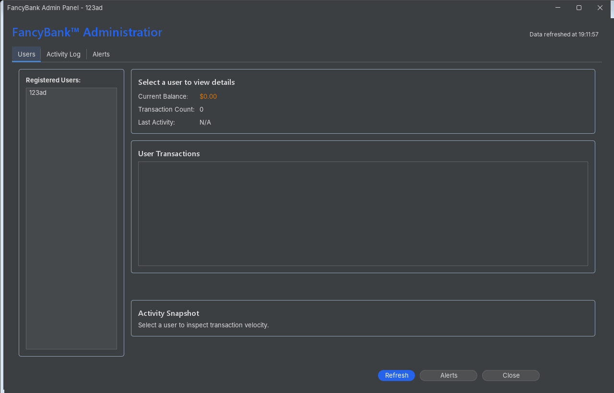

  # FancyBank

[](#)
[](#)
[](#)

FancyBank is a modern Java Swing e-banking and Business Intelligence simulation designed to demonstrate secure desktop application architecture, polished enterprise UI design, and maintainable Java engineering practices.

The application combines a sleek FlatLaf-based interface with secure local authentication, transaction history, balance visualization, and an administrator monitoring dashboard. It is intended as a portfolio-ready desktop application for showcasing practical Java, Swing, UI modernization, and security-conscious refactoring.

## Features

- Secure authentication with hashed PIN storage using PBKDF2
- First-admin bootstrap flow via a dedicated admin creator utility
- Local-only runtime data stored outside version control
- Banking simulation with deposits, withdrawals, and persistent balances
- Transaction history stored per user in a controlled runtime data directory
- Business Intelligence dashboard for administrators
- Suspicious activity detection with configurable alert thresholds
- Responsive Swing UI powered by FlatLaf and MigLayout
- Dark mode-ready visual system with modern typography
- XChart-powered balance visualization with dynamic resizing
- SVG icon support through FlatLaf Extras

## Tech Stack

- Java 17+
- Java Swing
- Maven
- FlatLaf
- FlatLaf Extras
- FlatLaf Inter Fonts
- MigLayout
- XChart
- PBKDF2WithHmacSHA256
- Local JSON persistence

## Screenshots

### Login



### Banking Dashboard



### Admin BI Dashboard



## Getting Started

### Prerequisites

- Java 17 or newer
- Maven 3.9 or newer
- Git

### Clone The Repository

```bash
git clone https://github.com/TryfonGav/FancyBank.git
cd FancyBank
```

### Build

```bash
mvn clean compile
```

### Run The Application

```bash
mvn exec:java
```

### Create The First Administrator

Run the dedicated admin creator before launching the main application if no administrator exists yet:

```bash
mvn exec:java -Dexec.mainClass=AdminCreator
```

The admin creator uses the same secure bootstrap path as the application and will refuse to create another administrator after one already exists.

## Runtime Data

FancyBank creates local runtime data under `data/`, including user records and transaction history. This directory is intentionally ignored by Git so every clone starts clean.

Ignored local data includes:

- `data/`
- `users.dat`
- `users.json`
- `*_history.txt`
- local database files such as `*.sqlite`, `*.sqlite3`, and `*.db`

If runtime data has already been tracked in Git, remove it from the index before publishing:

```bash
git rm -r --cached data
git rm --cached '*_history.txt' users.dat users.json
```

## Project Structure

```text
src/
  AdminCreator.java       # First-admin bootstrap utility
  AdminPanel.java         # BI and security monitoring dashboard
  AppUi.java              # FlatLaf UI configuration and shared UI helpers
  BankAppGui.java         # Banking dashboard and transaction view
  Main.java               # Application entry point
  TransactionRecord.java  # Transaction parsing and formatting
  UserManager.java        # Secure local user persistence
pom.xml                   # Maven build and dependency configuration
```

## Development Notes

- Do not commit runtime data or local credentials.
- Use Maven for dependency resolution instead of committing downloaded JAR files.
- Keep UI changes in the view layer and avoid coupling visual components to persistence logic.
- Prefer SwingWorker for blocking I/O to keep the UI responsive.

## License

Copyright <2026> <TRYFON GAVRILIS>

Permission is hereby granted, free of charge, to any person obtaining a copy of this software and associated documentation files (the “Software”), to deal in the Software without restriction, including without limitation the rights to use, copy, modify, merge, publish, distribute, sublicense, and/or sell copies of the Software, and to permit persons to whom the Software is furnished to do so, subject to the following conditions:

The above copyright notice and this permission notice shall be included in all copies or substantial portions of the Software.

THE SOFTWARE IS PROVIDED “AS IS”, WITHOUT WARRANTY OF ANY KIND, EXPRESS OR IMPLIED, INCLUDING BUT NOT LIMITED TO THE WARRANTIES OF MERCHANTABILITY, FITNESS FOR A PARTICULAR PURPOSE AND NONINFRINGEMENT. IN NO EVENT SHALL THE AUTHORS OR COPYRIGHT HOLDERS BE LIABLE FOR ANY CLAIM, DAMAGES OR OTHER LIABILITY, WHETHER IN AN ACTION OF CONTRACT, TORT OR OTHERWISE, ARISING FROM, OUT OF OR IN CONNECTION WITH THE SOFTWARE OR THE USE OR OTHER DEALINGS IN THE SOFTWARE.
